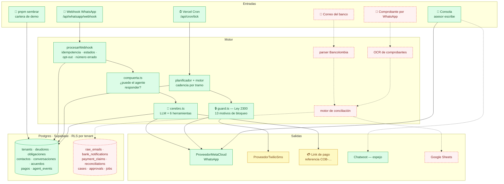
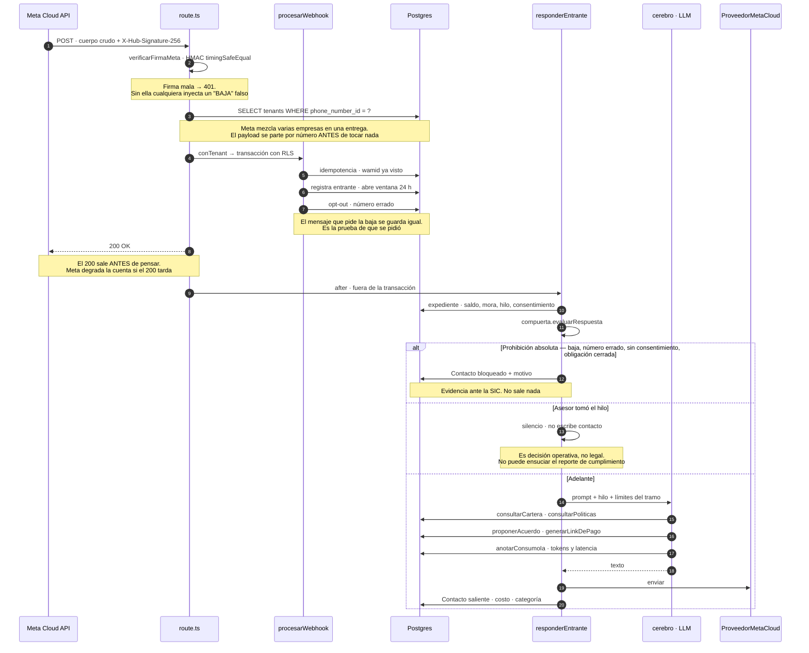
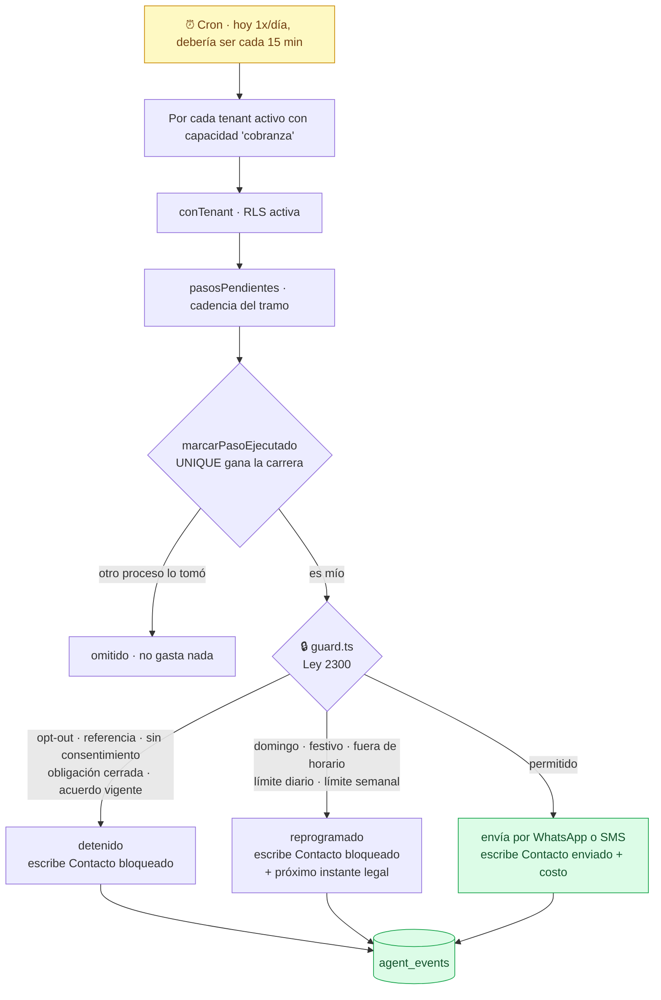
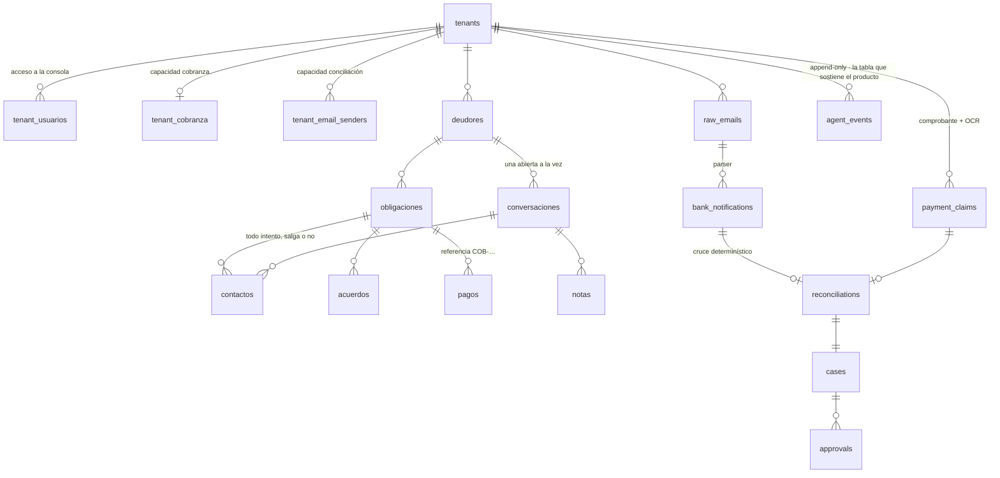
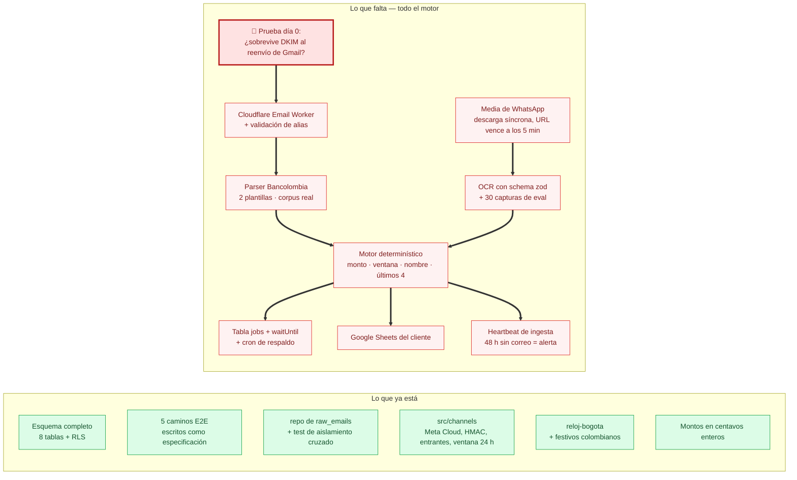
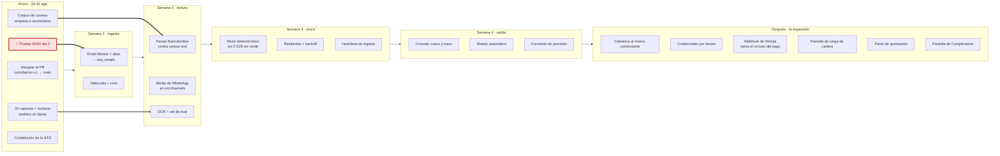

# Estado del producto — 24 de agosto de 2026

> Foto del repo, no del plan. Lo que dice acá se verificó corriendo el código:
> `pnpm test`, `pnpm typecheck`, `pnpm test:e2e`, y grep sobre qué tabla tiene
> código que la toque y cuál no. Si un módulo está escrito pero nadie lo llama,
> acá aparece como "escrito, sin conectar" y no como "listo".

---

## 0. Resumen

`cobra` es el motor de **dos productos sobre un mismo esquema**: cobranza y
conciliación.

| | Cobranza | Conciliación |
|---|---|---|
| Estado | **Construido y verificado.** Corre sobre Postgres real, con RLS por tenant, consola, agente y cron | **Solo esquema y especificación.** Cero motor |
| Evidencia | 950 tests verdes, `typecheck` limpio, 11 migraciones aplicadas, consola con tres pantallas vivas | 5 tests E2E que fallan con `no implementado: crearSistema` |
| Cliente | Ninguno todavía | Dos cerrados, ambos con Bancolombia |

La inversión de las últimas dos semanas es esa tabla. **El producto que está
construido no tiene cliente; el producto que tiene dos clientes cerrados no está
construido.** Todo lo que sigue es el detalle de por qué, y qué falta para
cerrar la brecha.

### Números

| Medida | Valor |
|---|---|
| Código (sin tests) | 17.262 líneas TS/TSX |
| Tests | 9.582 líneas · **950 tests en 48 archivos** · 12,6 s |
| Migraciones | 11 archivos · 974 líneas SQL |
| Scripts de operación | 8 comandos · 1.204 líneas |
| Commits | 47 · último el 20 de agosto |
| `pnpm typecheck` | limpio |
| `pnpm lint` | limpio · quedan dos avisos de variables sin usar en la especificación E2E, que desaparecen cuando se implemente |
| `pnpm test:e2e` | **5 de 5 fallan** — es la especificación de conciliación, sin implementar |
| PR abierto | `conciliacion-v1` → `main`, 46 commits, fast-forward limpio |

Requiere **Node 22** (`.nvmrc`). Con Node 20 vitest ni arranca.

---

## 1. Mapa de lo que existe hoy



**Verde**: escrito, probado y conectado.
**Amarillo**: escrito y probado, **no conectado a producción**.
**Rojo punteado**: no existe todavía.

---

## 2. Camino entrante — el que ya funciona

Es el flujo más maduro del repo. Un mensaje del deudor entra, el agente arma el
expediente, la compuerta decide si puede hablar, el modelo piensa y la respuesta
sale. Cada paso deja rastro.



**Las tres cosas que hacen que esto no sea un chatbot** — y que ya están en el código:

1. **El expediente entra por herramientas, no por el prompt.** El modelo tiene
   que *pedir* la cartera, y esa consulta queda anotada. Es lo que se muestra en
   la demo.
2. **Un domingo el agente sí contesta.** La Ley 2300 limita cuándo la empresa
   *contacta*, no si puede *responder*. Lo que no levanta ningún entrante son
   las cuatro prohibiciones absolutas.
3. **Si el modelo falla, `guionado.ts` ejecuta las mismas validaciones.** Un
   acuerdo fuera de rango se rechaza igual y el link que manda existe de verdad.

---

## 3. Camino saliente — el motor de cobro



**Las tres ramas escriben un `Contacto`, incluida la que no envía.** No es
simetría por prolijidad: ante un reclamo ante la SIC lo que prueba que la
empresa cumplió no es el mensaje que salió, es el que **no** salió y por qué.

Los 13 motivos de bloqueo del guard:

`destinatario_es_referencia` · `opt_out` · `numero_no_corresponde` ·
`sin_consentimiento` · `obligacion_cerrada` · `acuerdo_vigente` · `domingo` ·
`festivo` · `fuera_de_horario_legal` · `canal_distinto_al_preferido` ·
`fuera_de_horario_preferido` · `dia_distinto_al_preferido` · `limite_diario` ·
`limite_semanal`

---

## 4. El esquema, por capacidad

Un comerciante es `tenants` + `capacidades text[]`. Activarle el segundo
producto es un `INSERT`, no una migración. Esa decisión es la que permite que
conciliación entre como cuña y cobranza sea la expansión sobre el mismo cliente.



**Estado real tabla por tabla:**

| Grupo | Tablas | Código que las toca |
|---|---|---|
| Núcleo cobranza | `tenants`, `tenant_cobranza`, `tenant_usuarios`, `deudores`, `obligaciones`, `conversaciones`, `contactos`, `acuerdos`, `pagos`, `cadencias`, `plantillas`, `ventanas_servicio`, `webhook_procesados`, `sesiones`, `notas`, `etiquetas`, `lecturas` | ✅ repositorios, consola, motor |
| Auditoría | `agent_events` | ✅ agente, consumo, `pnpm auditoria` |
| Ingesta de cartera | `cargas`, `filas_cuarentena`, `conectores` | ⚠️ **ninguno.** El esquema existe; `src/ingest` son funciones puras que nadie llama desde la app |
| Operación | `avisos_cupo`, `notificaciones` | ⚠️ ninguno |
| Conciliación | `raw_emails`, `bank_notifications`, `payment_claims`, `reconciliations`, `cases`, `approvals`, `jobs`, `tenant_email_senders` | ❌ solo `raw_emails` tiene repositorio. Las otras siete: cero referencias en `src/` |

---

## 5. Conciliación: qué hay y qué falta

Es el producto que se decidió vender primero, y hoy es lo menos construido del
repo. Lo que existe son los **cimientos** y la **especificación**.



Los cinco E2E que hoy fallan **son el contrato del producto**, no deuda:

1. Concilia cuando el comprobante llega primero y el aviso del banco cuatro minutos después
2. Concilia cuando el aviso llega primero y el comprobante dos horas después
3. **Nunca confirma un comprobante que no tiene aviso del banco detrás**
4. No concilia dos veces el mismo pago aunque el comprobante se reenvíe
5. Manda a cuarentena un correo firmado por otro dominio y jamás lo usa para confirmar

**Bloqueante de día 0, sin resolver:** verificar que la firma DKIM de
Bancolombia sobreviva al reenvío de Gmail. Treinta minutos de trabajo. Si no
sobrevive, la ingesta se va a IMAP y **cambia el diseño entero**. Escribir el
parser antes de esa prueba es apostar la semana 1.

---

## 6. Los huecos de cobranza — lo que impide encenderlo con un cliente

Ordenados por lo que costaría descubrirlos tarde.

```mermaid
flowchart TD
  A["🔴 Un solo número remitente para todos los tenants"]
  A --> A1["El webhook resuelve el tenant por phone_number_id,<br/>pero crearProveedores arma el remitente con META_PHONE_NUMBER_ID del entorno.<br/>Con dos clientes vivos, al deudor del segundo le contesta el número del primero.<br/><b>Arreglo: credenciales por tenant, no una línea</b>"]

  B["🔴 El circuito del pago no se cierra"]
  B --> B1["wompi.ts tiene checkout, checksum e interpretación de eventos, con tests.<br/>Pero no hay ruta /api/wompi/webhook y el link del agente apunta<br/>a nuestra propia página /pagar. Nadie concilia un pago real todavía"]

  C["🟠 La cartera solo entra por pnpm sembrar"]
  C --> C1["src/ingest mapea y normaliza Excel/CSV con tests,<br/>pero nadie lo llama: sin pantalla de carga, sin escribir en cargas<br/>ni en filas_cuarentena. Un cliente real no tiene cómo subir su cartera"]

  D["🟠 RLS no aplica en el camino del agente"]
  D --> D1["El turno corre en after, fuera de conTenant — a propósito,<br/>para no vaciar el pool esperando al modelo.<br/>El aislamiento depende del WHERE tenant_id de cada consulta.<br/>Revisado a mano; nada lo verifica solo mañana"]

  E["🟠 El cron es diario"]
  E --> E1["Vercel Hobby permite uno por día.<br/>Un paso que queda fuera de ventana a las 8:05 espera hasta mañana.<br/>Producción real necesita Pro y */15 * * * *"]

  F["🟡 Sin panel de aprobación"]
  F --> F1["La tabla approvals existe y el dominio contempla esperando_aprobacion,<br/>pero no hay pantalla. Hoy proponerAcuerdo aprueba lo que cabe en rango<br/>y escala el resto"]

  G["🟡 Sin backups"]
  G --> G1["Supabase free no tiene PITR.<br/>agent_events es append-only justamente porque es la evidencia"]

  H["🟡 Pestaña Cumplimiento apagada"]
  H --> H1["Es el entregable que sostiene la venta:<br/>el log de envíos bloqueados con su motivo.<br/>Los datos están en contactos; falta la pantalla"]

  classDef alto fill:#fee2e2,stroke:#b91c1c,color:#7f1d1d
  classDef medio fill:#fef9c3,stroke:#ca8a04,color:#713f12
  classDef bajo fill:#f1f5f9,stroke:#64748b,color:#334155
  class A,B alto
  class C,D,E medio
  class F,G,H bajo
  class A1,B1,C1,D1,E1,F1,G1,H1 bajo
```



Más chico, pero real:

- ~~1 error de lint~~ y ~~el README desactualizado~~ se arreglaron junto con
  este documento. El lint escondía un bug de la pantalla: la ventana de 24 h se
  vencía con el asesor mirándola y el redactor seguía ofreciendo texto libre.
- **El motor está apagado a propósito.** Sin `PROVEEDOR_WHATSAPP=meta` todo cae
  a `ProveedorSimulado`: escribe la fila y no llama a nadie. Es la decisión
  correcta mientras el código lo revisó una sola persona.

---

## 7. Hacia dónde vamos



**La lógica de la secuencia**, que no es obvia mirando el código:

- Conciliación va primero porque es el producto pequeño y **es el cliente más
  cercano**: dos cerrados, ambos Bancolombia. Cobranza es la expansión sobre el
  mismo comerciante, no un producto distinto.
- Por eso `src/ingest`, `src/cadence` y el resto de `src/compliance` no están
  dormidos: son la otra mitad de un solo sistema, esperando su cliente.
- Alcance v1 **solo inbound**. El riesgo de que Meta tumbe el número vive en el
  outbound; sin cobro proactivo no hay riesgo real. Y los mensajes de servicio
  dentro de la ventana de 24 h no consumen cupo, así que el volumen nunca fue la
  limitante: el único motivo para esperar la verificación de Meta es el cupo de
  2 números.
- El cruce es **determinístico**. No se le delega a un modelo decidir si dos
  registros son el mismo pago. El modelo lee la imagen; la decisión es código.
- Mientras no haya aviso del banco, el cliente ve *"estamos verificando"*, nunca
  *"confirmado"*. Un comprobante falso nunca produce una confirmación: produce
  una revisión.

---

## 8. Las tres decisiones que no conviene revisitar sin leer el porqué

1. **El dinero nunca pasa por nosotros.** La cuenta de la pasarela es del
   cliente. Recaudar y girar sería actividad de agregador, con exposición ante
   la SFC y SARLAFT.
2. **WhatsApp va por Meta Cloud API directo, no por un revendedor.** Un BSP
   cobra USD 0.005 encima de cada mensaje, entrante y saliente, incluidos los de
   la ventana de 24 h que Meta regala — que en un agente conversacional son el
   grueso del tráfico. La plantilla baja de COP 24 a COP 3,2 y la conversación
   de COP 20 a cero.
3. **La unidad de costo de IA es la conversación, no el token.** El cupo de
   conversaciones ya es el tope de exposición. La vara son los COP 180 del
   excedente vendido por conversación; la primera palanca de optimización es
   caché de prompt, porque el prefijo de `construirPrompt` es idéntico entre
   llamadas.

---

## 9. Comandos

```bash
nvm use                # Node 22 obligatorio
pnpm test              # 950 tests, 12,6 s
pnpm test:e2e          # 5 rojos a propósito: la especificación de conciliación
pnpm typecheck
pnpm migrar            # aplica las 11 migraciones
pnpm sembrar           # tenant de demo con cartera, hilos y mensajes
pnpm tsx scripts/borrar-tenant.mts <uuid>   # vaciar antes de resembrar; dry-run salvo --si-borrar
pnpm simular           # mensaje entrante por el camino real del webhook
pnpm auditoria         # lee agent_events
pnpm verificar-db
pnpm dev               # landing en /, consola en /consola, demo en /demo
```
