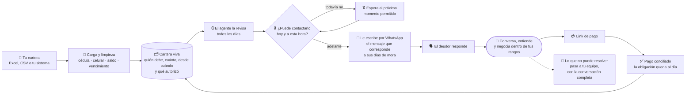
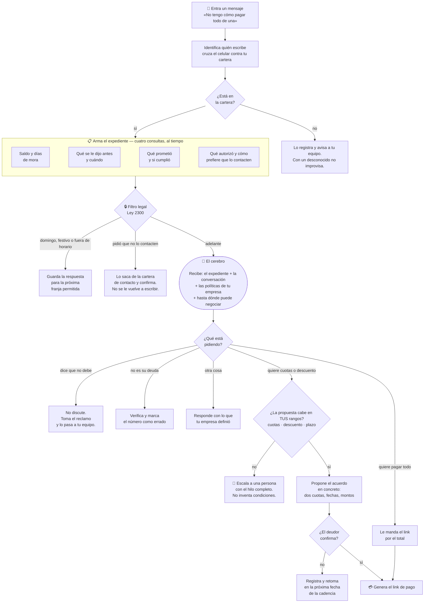
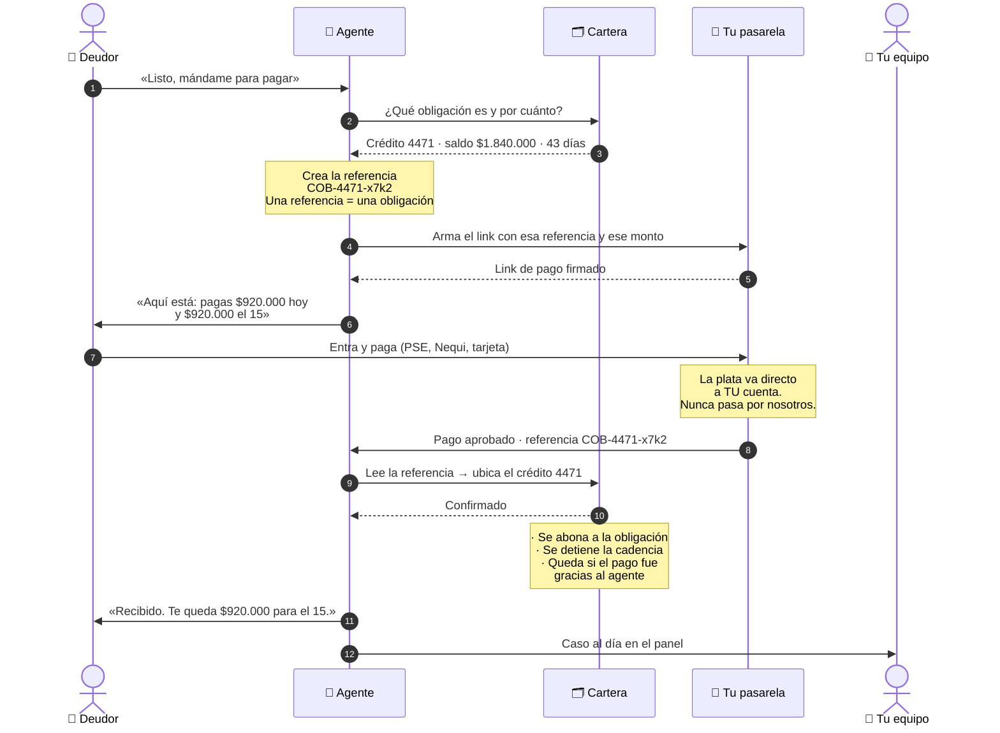

# Cómo funciona el agente de cobranza

> Documento para conversar con un cliente. Explica el recorrido completo sin
> entrar en la implementación. Si quieres el detalle técnico, está en el código:
> `src/compliance/guard.ts`, `src/cadence/planificador.ts`, `src/payments/wompi.ts`.

El agente hace tres cosas que hoy hace una persona: **recordar**, **negociar** y
**cobrar**. La diferencia es que no se le olvida ninguna, no trabaja fuera del
horario que permite la ley, y deja escrito por qué hizo cada cosa.

---

## 1. Panorama — de la cartera al recaudo

**Lo que hay que retener de este diagrama:**

- La cartera sigue siendo tuya. El agente la lee y la actualiza; no la reemplaza.
- Antes de cada mensaje hay un **filtro legal**. No es un ajuste: es un candado.
  Si hoy no se puede, el mensaje espera, no sale.
- El circuito **se cierra solo**: el pago vuelve a la cartera sin que nadie
  concilie a mano.
- Todo lo que el agente no puede resolver **vuelve a tu equipo**, con la
  conversación completa.

---

## 2. Cuando llega un mensaje

Este es el corazón. Alguien responde al WhatsApp de tu empresa y en pocos
segundos pasa todo esto.

### Las tres cosas que hacen que esto no sea un chatbot

**El expediente.** Un chatbot responde con lo que le escribieron. El agente
responde sabiendo que este señor debe $1.840.000, lleva 43 días, ya prometió
pagar el 12 y no cumplió, y que prefiere que le escriban en las tardes. Esa es
la diferencia entre "¿en qué le puedo ayudar?" y "don Jorge, quedamos el 12 y no
alcanzó; ¿lo partimos en dos?".

**El filtro legal va antes, no después.** No es que el agente *evite* escribir un
domingo: es que el mensaje **no puede** salir un domingo. Tampoco puede ser el
tercero de la semana, ni ir dirigido a la referencia que el deudor puso en el
pagaré. Cada bloqueo queda escrito con fecha, hora de Bogotá y motivo.

**Los rangos son tuyos y son duros.** Tú defines hasta cuántas cuotas y qué
descuento por cada etapa de mora. El agente negocia adentro de eso. Si el deudor
pide más, no regatea ni "consulta": escala a una persona con toda la
conversación. Ningún acuerdo llega al deudor sin que un humano tuyo lo apruebe.

---

## 3. El link de pago y las facturas

La pregunta que siempre aparece: *¿cómo sabe el sistema que ESE pago era de ESA
factura?*

La respuesta es la **referencia**. El agente no manda un link genérico: crea uno
con un código propio que amarra ese cobro a esa obligación. Cuando el pago
regresa, el código dice de quién era.

**Tres puntos que conviene subrayar en la reunión:**

1. **La plata nunca pasa por nosotros.** El link va contra tu propia pasarela y
   tu propia cuenta. Nosotros solo ponemos el código de referencia.
2. **La conciliación es automática porque el código viene de nosotros.** No hay
   nadie cruzando un extracto contra una lista de facturas.
3. **Queda medido qué recuperó el agente.** Si el pago entra dentro de los 7 días
   siguientes a un contacto del agente, se marca como atribuible. Eso es lo que
   permite discutir el resultado con números y no con impresiones.

---

## 4. Qué pasa si…

| Situación | Qué hace el agente |
|---|---|
| **Pide que no lo contacten más** | Lo deja de contactar de inmediato y se lo confirma. El mensaje queda guardado como prueba de cuándo lo pidió. Nota: en Colombia "cancelar" quiere decir *pagar*, y el agente lo sabe — no lo toma como baja. |
| **Dice que no debe nada** | No discute ni presiona. Toma el reclamo, detiene la cadencia de ese caso y lo pasa a tu equipo. |
| **Contesta la mamá, la esposa, un vecino** | Corta. La ley prohíbe cobrarle a terceros y a las referencias. Es un bloqueo absoluto, no una recomendación. |
| **Nunca contesta** | Sigue la cadencia por etapa de mora, con mínimo una semana entre mensajes, y luego para. No hostiga. |
| **Paga por fuera del link** (consignación, oficina) | Cuando tu sistema marca la obligación como pagada, la cadencia se detiene sola. Por eso el agente necesita ver el estado de la cartera, no solo mandarle mensajes. |
| **Pide un descuento que no está autorizado** | No lo niega en seco ni lo concede: escala a una persona con la conversación completa y le dice al deudor que lo van a revisar. |
| **Es domingo y el deudor escribe** | Puede responder — la ley limita cuándo *tú* lo contactas, no cuándo él te escribe a ti. Lo que no sale un domingo es un mensaje que arranque el agente. |
| **El número está errado** | Lo marca, deja de escribir a ese número y avisa a tu equipo para que actualice la cartera. |
| **Se cae WhatsApp** | El mensaje reintenta y, si el paso lo permite, sale por SMS. |

---

## 5. La prueba, que es lo que casi nadie tiene

Cada intento de contacto queda registrado. **También los que no salieron.**

Un registro dice: a quién, por qué canal, a qué hora exacta de Bogotá, con qué
mensaje, y si se bloqueó, cuál de los trece motivos lo bloqueó.

Eso significa que si mañana la SIC pregunta *"¿por qué le escribieron a este
señor un domingo?"*, la respuesta no es una explicación: es un renglón que dice
que **no** se le escribió, y a qué hora del lunes salió el mensaje en su lugar.

Las casas de cobranza tradicionales no tienen cómo demostrar eso. Es la razón
principal por la que este agente existe.
